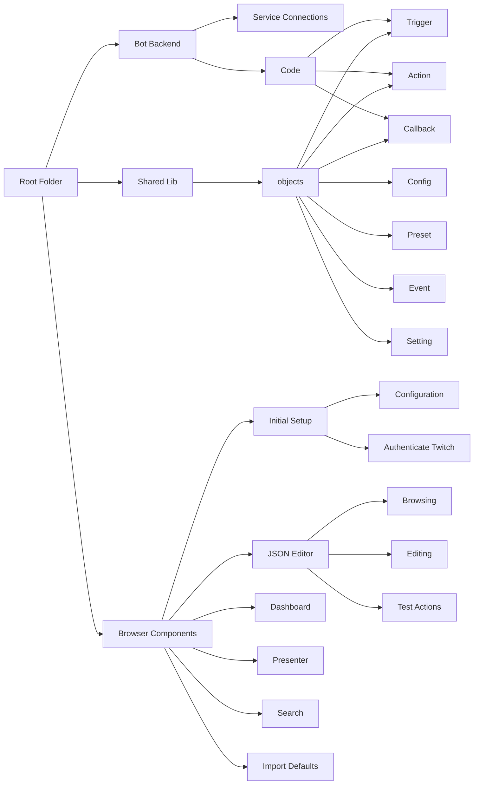
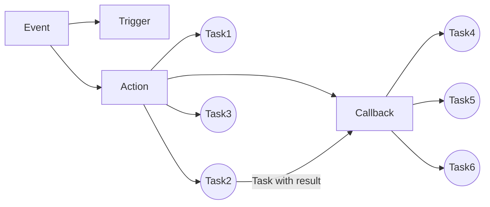
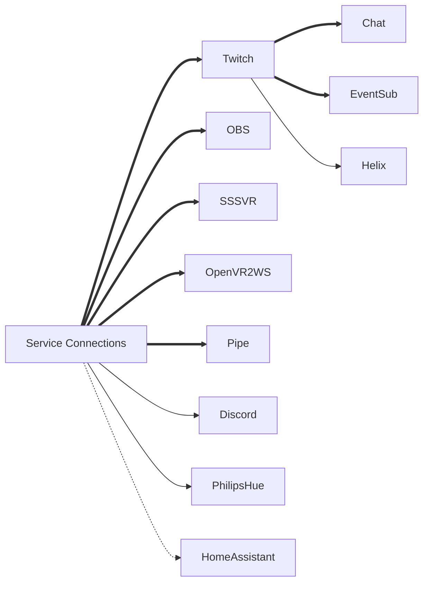
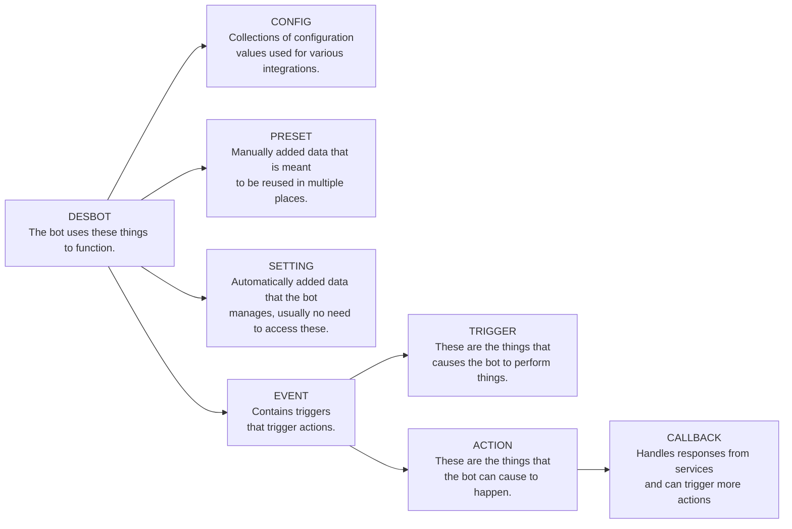

# Project Structure

---

- one
- twp

# Coding Plan
## Keep
1. Database structure
2. Database handler
3. Objects (actions, triggers, configs, options)
4. API Connections
   * Steam
   * SSSVR
   * OpenVR2WS
   * Pipe
5. Action handling
6. Editor data modification functions

## Refurbish
1. AudioPlayer - move to Presenter
2. Sign - move to Presenter
 
## Remake
1. Callbacks
   * Remake how user data is propagated from: trigger --> action --> callback
     * What this means, is that we should change where we retrieve additional data.
   * Switch callbacks from hard-coded to customizable entries
2. Editor
   * Vue: Single File Components
   * Vue: Single Page Application

## Implement
1. Third party libraries
   * Twitch
   * OBS
   * Discord
   * Philips Hue / Home Assistant

---

# New Data Flow
1. Callbacks are now customizable, repeatable, referencable, just like actions.  
2. A callback when complete can trigger actions in turn.  
3. Because triggers run actions that can run other actions through the System action or Callbacks,  
we should propagate a list of previous actions, and prevent execution of previously executed actions.

## Callback Payload
Callbacks will have to use a commonly shaped payload. This should include properties for:
1. Event Data
   * User (Twitch ID, name, nick, color, avatar, url...)
   * Trigger
   * Action
2. Image
   * Screenshot 
3. Sound
   * Sound FX
   * Text-to-speech
4. Texts
   * Title
   * Subtitle
5. Session Data
   * Game info
   * Stream uptime etc?

---

# Service Connections

---

# Data Types
*(From the original readme)* There are a range of data sources used by the events, triggers and actions. These are described below.
