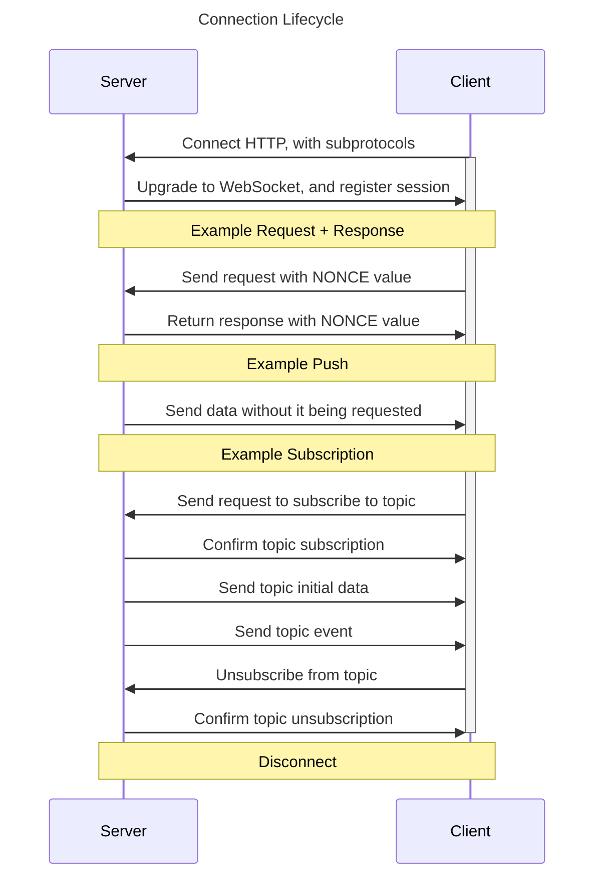

# WebSocket Coms

## Communication Flow



## Explanation

### Connection Data

When a client connects, it will provide a subprotocol, authentication and optional ID.

* Subprotocol, the type of connection the client establishes: `db`, `presenter`, `dashboard`
* Authentication, some means of shallow authentication, not sure if per subprotocol or singular.
* ID, optional value that identifies this client among other clients using the same subprotocol.

### Send to Client

* Providing the subprotocol will limit broadcasts to clients connected with that subprotocol.
* To differentiate between clients in a group there should be `Preset`-objects associated with them.
    * The ID for this object is what is included in the subprotocol values.
    * When using this ID, messages will only be sent to that client, instead of broadcasting to the whole group.

### Send to Server

* There are no headers or hidden values that are possible to send with a message, so we will only encode a JSON object that will be pre-defined in the shared lib types.

## Messages

### Sent to Presenter

```json
{
  "key": "some-kind-of-identifier",
  "data": "whatever data we need"
}
```