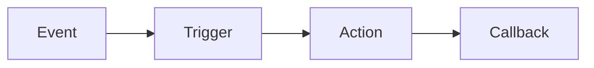

# Objects
* `Action` - Actions that triggering this event will cause.
* `Callback` - Handle the result of an action.
* `Config` - Configuration for the bot.
* `Event` - The main class that is used to organize a flow.
* `Preset` - A collection of items that can be used as input values.
* `Setting` - Values that the system adds and maintains.
* `Trigger` - Conditions and listeners that will trigger this event

The natural flow for the main classes when running the bot:

`Config`, `Preset` and `Setting` are all used in the running code for `Event`, `Trigger`, `Action` or `Callback`.